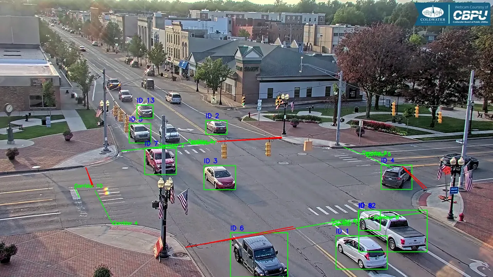
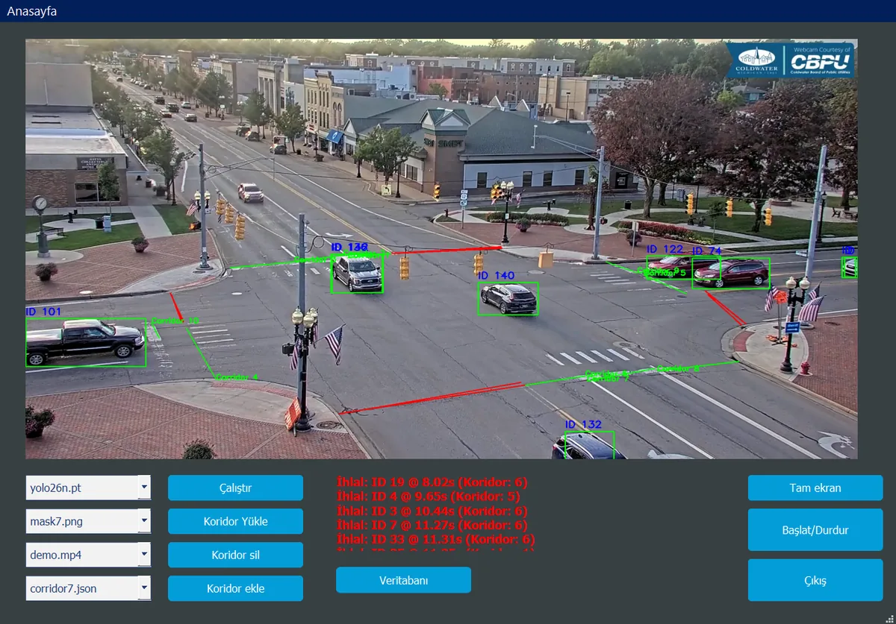
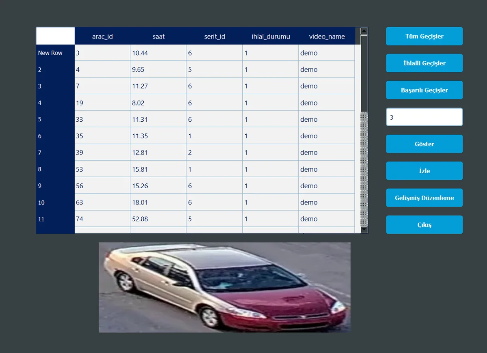
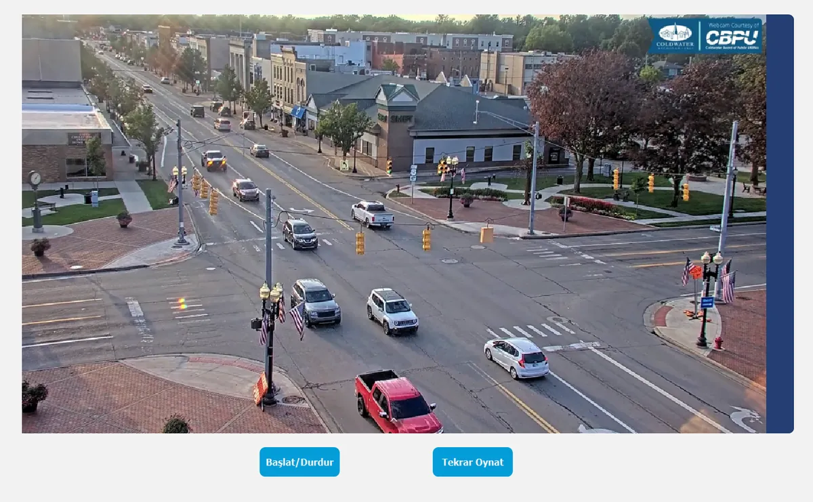

# Şerit Kontrol Sistemi

Sabit bir trafik kamerası görüntüsünde araçları tespit edip takip eden, tanımlı
koridorlara giren ama çıkışını tamamlamayan araçları **şerit ihlali** olarak
kaydeden uçtan uca bir sistem. Masaüstü tarafı PyQt5, servis tarafı Flask,
kayıtlar ise MySQL ya da SQLite üzerinde tutulur.

İhlaller hem PyQt arayüzünden hem de web arayüzünden görüntülenebilir.
Kullanıcı bir ihlale gerekçe belirterek itiraz eder; admin itirazı inceler,
aracın kaydını izler ve uygun görürse ihlal damgasını kaldırır.

Web arayüzü ayrı depodadır: [Serit-Kontrol-Web](https://github.com/firathdr/Serit-Kontrol-Web)

## Ekran görüntüleri

| Canlı tespit ve takip | Masaüstü arayüzü |
| --- | --- |
|  |  |

| Araç veritabanı | İhlal kaydı oynatıcı |
| --- | --- |
|  |  |

## Nasıl çalışır

1. **Maske** — `masks/` altındaki ikili maske, karenin yalnızca yol kısmını
   bırakır; kaldırım ve otopark gibi alanlar tespite hiç girmez.
2. **Tespit** — YOLO yalnızca araç sınıflarını (car, motorcycle, bus, truck)
   arar (`core/detector.py`).
3. **Takip** — DeepSORT her araca kalıcı bir kimlik verir (`core/pipeline.py`).
4. **Koridorlar** — Her koridorun bir giriş, bir çıkış çizgisi vardır
   (`corridors/*.json`). Aracın merkezi giriş çizgisini kestiği anda araç o
   koridora "girmiş" sayılır ve kırpılmış görüntüsü veritabanına yazılır.
5. **Karar** — Giren araç çıkış çizgisini de keserse **başarılı geçiş**, kesmeden
   kareden kaybolursa **ihlal** olarak kaydedilir.

## Kurulum

Python 3.10+ gerekir.

```bash
python -m venv .venv
.venv\Scripts\activate        # Linux/macOS: source .venv/bin/activate
pip install -r requirements.txt
```

### Model ve video

Ağırlıklar ve videolar depoya dahil değildir:

- Eğitilmiş ya da hazır bir YOLO ağırlığını `models/` içine koyun (ör. `yolo11n.pt`).
  Ultralytics ağırlıkları COCO ile eğitildiği için araç sınıflarını doğrudan tanır.
- İşlenecek videoyu `videos/` içine koyun.
- Videoya uygun bir maske `masks/`, koridor tanımı `corridors/` altında olmalıdır.
  Koridorlar arayüzden çizilip **Koridorları Kaydet** ile aynı klasöre yazılabilir.

### Veritabanı

Varsayılan olarak hiçbir kurulum gerekmez: `database/mysql.json` yoksa sistem
proje kökündeki `data/serit.db` SQLite dosyasını kullanır ve tabloları ilk
çalıştırmada kendisi oluşturur.

MySQL kullanmak isterseniz:

```bash
mysql -u root -p -e "CREATE DATABASE serit_kontrol CHARACTER SET utf8mb4;"
mysql -u root -p serit_kontrol < database/schema_mysql.sql
cp database/mysql.example.json database/mysql.json   # bilgileri düzenleyin
```

`database/mysql.json` var olduğu sürece MySQL, silindiğinde yine SQLite kullanılır.

## Kullanım

```bash
python app.py          # Flask API + PyQt arayüzü
python gui/gui_pyqt.py # yalnızca arayüz
python api/main.py     # yalnızca API
```

Arayüzde sırasıyla model, maske, video ve koridor dosyası seçilir; **Başlat** ile
işleme başlar. Görüntü üzerine tıklanarak yeni koridor çizgileri eklenebilir,
**Veritabanı** düğmesi kayıt ekranını açar.

## Klasör yapısı

```
Serit-Kontrol/
├── app.py                    # API + arayüzü birlikte başlatır
├── api/main.py               # Flask servisleri (kullanıcı, araç, ihlal, itiraz)
├── core/
│   ├── detector.py           # YOLO sarmalayıcı
│   ├── pipeline.py           # maske → tespit → takip → koridor kararı
│   ├── arac_yol.py           # koridor/çizgi modeli, kesişim testi
│   └── sort.py               # kullanılmayan alternatif takipçi
├── gui/
│   ├── gui_pyqt.py           # ana pencere
│   ├── db_gui.py             # araç kayıtları ekranı
│   ├── gelimis_gui.py        # kayıt düzenleme ekranı
│   ├── video_player.py       # ihlal anı oynatıcı
│   └── *.ui                  # Qt Designer arayüz dosyaları
├── database/
│   ├── db_config.py          # MySQL/SQLite bağlantısı
│   ├── ihlal_ekle.py         # geçiş/ihlal kaydı
│   └── schema_*.sql          # tablo şemaları
├── corridors/                # koridor tanımları (JSON)
├── masks/                    # yol maskeleri (PNG)
├── models/                   # YOLO ağırlıkları (depoya dahil değil)
└── videos/                   # işlenecek videolar (depoya dahil değil)
```

## Veritabanı tabloları

| Tablo | İçerik |
| --- | --- |
| `araclar` | Her geçişin kaydı: `arac_id`, `saat`, `serit_id`, `ihlal_durumu`, `video_name` |
| `arac_goruntu` | Koridora giriş anındaki kırpılmış araç görüntüsü ve giriş zamanı |
| `kullanicilar` | Web arayüzü kullanıcıları ve rolleri |
| `itiraz_kayit` | İhlale yapılan itirazlar ve admin kararı |

## API uçları

Kimlik doğrulama JWT ile yapılır; `Authorization: Bearer <token>` başlığı beklenir.

| Uç | Yöntem | Açıklama |
| --- | --- | --- |
| `/api/registr` | POST | Kullanıcı kaydı |
| `/api/login` | POST | Giriş, JWT üretir |
| `/api/araclar` | GET | Araç kayıtları ve görüntüleri |
| `/api/araclar/<video_name>/<arac_id>` | GET | Tek aracın detayı |
| `/api/araclar/<video_name>/<id>` | DELETE | Araç kaydını siler |
| `/api/itiraz_kayit` | GET | Kullanıcının itirazları |
| `/api/itiraz_kayit/detay` | GET | Tek itirazın detayı |
| `/api/itiraz_et` | POST | İtiraz oluşturur |
| `/api/videos/<video_name>` | GET | İhlal anının video klibi (ffmpeg gerekir) |
| `/api/admin/kullanicilar` | GET | Tüm kullanıcılar |
| `/api/admin/yetkilendir` | POST | Kullanıcıyı admin yapar |
| `/api/admin/kullanici-sil` | DELETE | Kullanıcı siler |
| `/api/admin/ihlaller` | GET | Tüm ihlaller |
| `/api/admin/itirazlar` | GET | Tüm itirazlar |
| `/api/admin/itiraz` | PUT | İtiraz durumunu günceller |

## Sorun giderme

- **`OMP: Error #15 ... libiomp5md.dll`** — Anaconda ile PyTorch'un OpenMP
  kütüphaneleri çakışıyor. Çalıştırmadan önce `KMP_DUPLICATE_LIB_OK=TRUE`
  ortam değişkenini verin.
- **Tespit yavaş** — CUDA yoksa CPU kullanılır. Daha küçük bir model seçin ya da
  `Pipeline(..., imgsz=640)` ile tespit çözünürlüğünü düşürün.
- **Uzaktaki araçlar bulunamıyor** — `imgsz` değerini artırın (varsayılan 1280).
- **`/api/videos/...` hata veriyor** — Klip kesme için sistemde `ffmpeg` kurulu olmalıdır.

## Lisans

MIT — ayrıntılar için [LICENSE](LICENSE).
